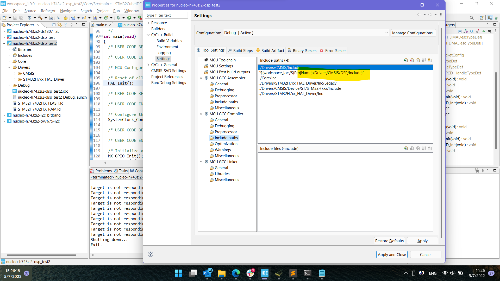
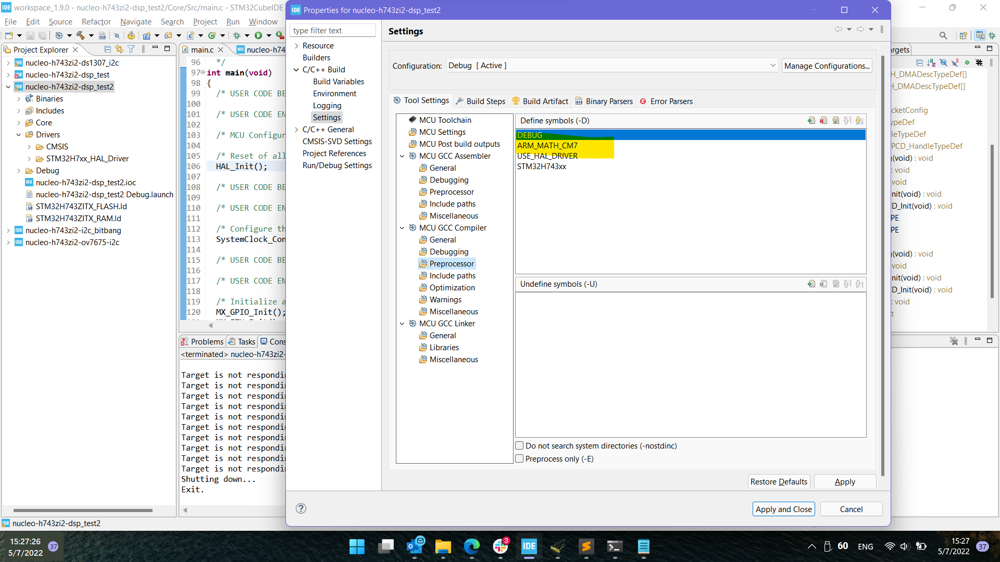
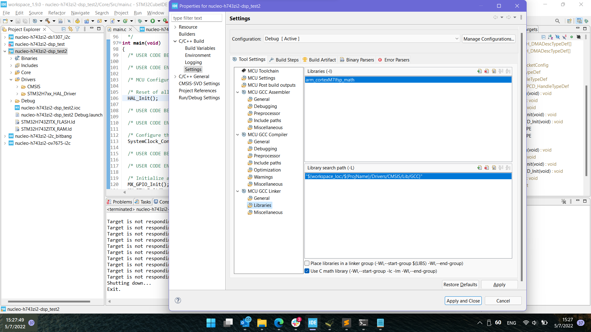
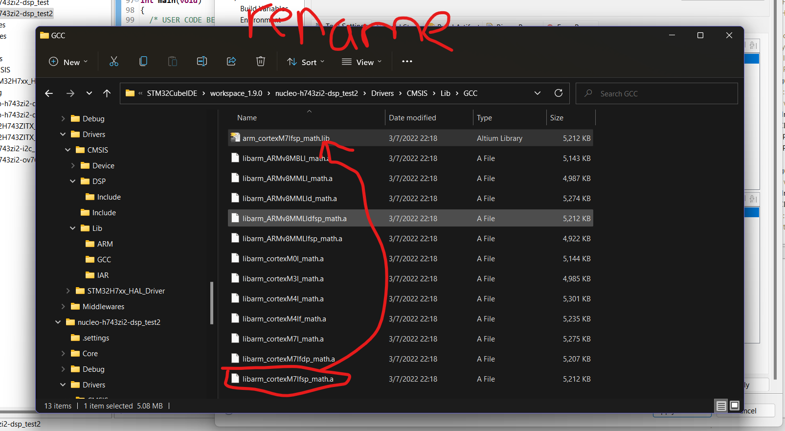

Pay-Elec Testing
================

A temporary repository for quick and dirty sharing of code. The git repo is initialized in the workspace directory of the STM32CubeIDE. But we are only committing key files that have changed.


This is an example folder structure of the entire STM32CubeIDE project. We are only committing the following key files


Using STM32 DSP Core
--------------------
There are included ARM libraries provided as part of STM32 DSP that can accelerate matrix operations
Based on CMSIS
The Common Microcontroller Software Interface Standard (CMSIS) is a vendor-independent abstraction layer for microcontrollers that are based on Arm Cortex processors.
CMSIS source files are included in the FW package
C:\Users\yongd\STM32Cube\Repository\STM32Cube_FW_H7_V1.10.0\Drivers\CMSIS\DSP

This is the contents of the `DSP` folder.
```
├── DSP_Lib_TestSuite
│   ├── Common
│   ├── DspLibTest_FVP
│   ├── DspLibTest_FVP_A5
│   ├── DspLibTest_MPS2
│   ├── DspLibTest_SV_FVP
│   ├── DspLibTest_SV_MPS2
│   ├── DspLibTest_SV_Simulator
│   ├── DspLibTest_Simulator
│   └── RefLibs
├── Examples
│   └── ARM
├── Include
├── Lib
│   ├── ARM
│   ├── GCC
│   └── IAR
├── Projects
│   ├── ARM
│   ├── GCC
│   └── IAR
├── PythonWrapper
│   └── cmsisdsp_pkg
└── Source
    ├── BasicMathFunctions
    ├── CommonTables
    ├── ComplexMathFunctions
    ├── ControllerFunctions
    ├── FastMathFunctions
    ├── FilteringFunctions
    ├── MatrixFunctions
    ├── StatisticsFunctions
    ├── SupportFunctions
    └── TransformFunctions
```

Setup
-----
Follow here: https://community.st.com/s/article/configuring-dsp-libraries-on-stm32cubeide


1. You have to copy the `Include` and `Lib` folder into your new STM32CubeIDE project directory.
2. update the GCC compile settings to have the `Include` folder in the include path
3. update the GCC linker setting to include the `Lib\GCC` folder.
4. add the debug symbol for the ARM processor you're using.

See the pictures folder.





Deviation from setup
--------------------
You have to rename the `Lib\GCC\libarm_cortexM7lfsp_math.a` file to `arm_cortexM7lfsp_math.lib`. The linker is expecting to link .lib file. So you'll have to explicitly re-name it. Also you do not need to pre-fix "lib" to the file (aka `libarm....`). It seems that STM32CubeIDE does this itself. 




Printing floats
---------------
- https://forum.digikey.com/t/easily-use-printf-on-stm32/20157
- need to enable "Use float with printf..." from project properties > C/C++ build > settings > MCU settings.
- `printf("result: %.1f\n", result);`
- output: `result: 14.0`


```
.
├── Core
│   ├── Inc
│   ├── Src
│   └── Startup
├── Debug
│   ├── Core
│   │   ├── Src
│   │   └── Startup
│   └── Drivers
│       └── STM32H7xx_HAL_Driver
└── Drivers
    ├── CMSIS
    │   ├── DSP
    │   ├── Device
    │   ├── Include
    │   └── Lib
    └── STM32H7xx_HAL_Driver
        ├── Inc
        └── Src

19 directories
```

Key Files
---------
1. .ioc file = project setup and pin configuration. Used by the STM32CubeMX code generator.
2. core/Inc/* = all header files
3. core/Src/* = all source files

All the other stuff is generic and can be generated on the fly by the STM32CubeIDE itself. So it's redundant to upload it to GitHub.